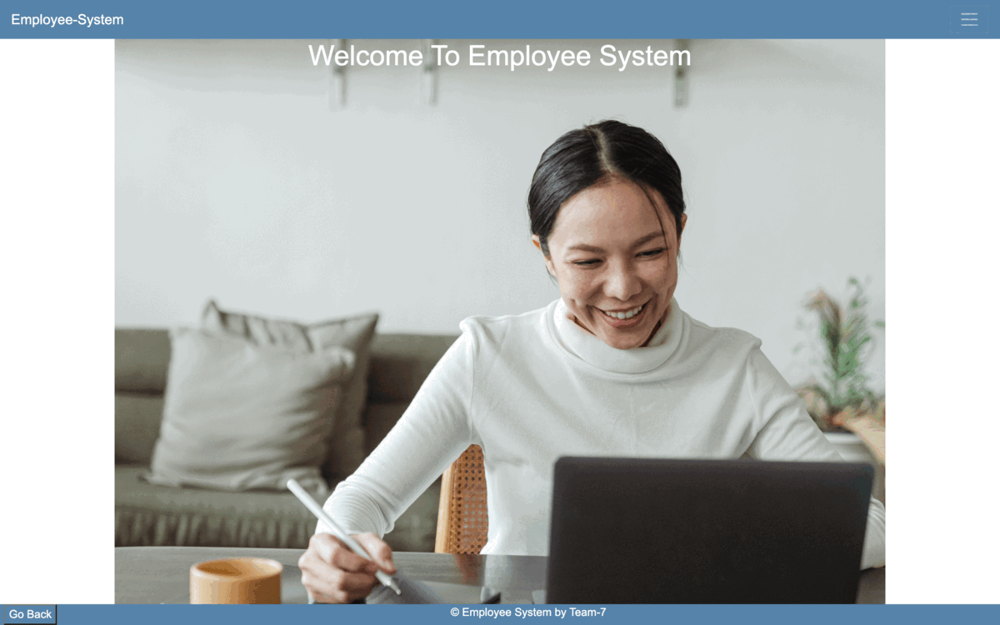

# Employee-System

- Employee-System is a portal made for HR/Mangers to maintain a record of the employees.
- In this application the user can perform CRUD operations for various case user stories.
- This project was created using Angular, Spring Boot and MongoDB.
- Yet to add some features like compensations.

## Advantages:

- Users can create, edit, and remove employees/details or standard CRUD operations.
- User can search for a particular employee.
- User can also include compensation details to a specific employee.

## To Run It Locally:

- Install Spring Suite Tools.
- git clone https://github.com/bhumikakr/Employee-System.git
- Run frontend on terminal.
- npm install
- npm start
- Run backend through Spring Suite Tools as Spring Boot App.
- Then go to localhost:4200
- Toggle around and explore different user stories.
